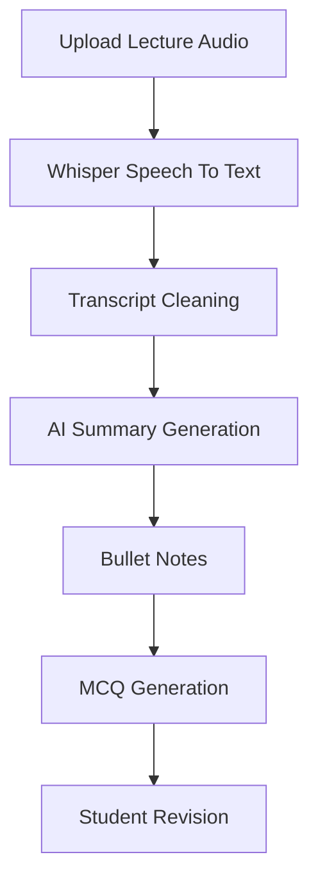

# 🎙️ AI-Powered Lecture Voice-to-Notes Generator

<div align="center">


### 🎧 Transform Lecture Audio into Notes, Summaries & MCQs with AI

🔗 **Live Demo:** https://lecture-voice-to-notes-generator-p3ccpai8hikso4oiohhx4f.streamlit.app/

🔗 **GitHub Repository:** https://github.com/RaghavSharma-git/Lecture-Voice-to-Notes-Generator

</div>

---

## 📖 Overview

**Lecture Voice-to-Notes Generator** is an AI-powered educational tool that helps students convert lecture recordings into structured learning materials.

Simply upload a lecture audio file and the application automatically:

✅ Transcribes speech to text

✅ Cleans noisy transcripts

✅ Generates concise summaries

✅ Creates exam-ready bullet notes

✅ Produces interactive MCQs for revision

This eliminates manual note-taking and helps students revise faster.

---

## ✨ Features

| Feature                | Description                                    |
| ---------------------- | ---------------------------------------------- |
| 🎙️ Speech-to-Text     | Converts lecture audio into text using Whisper |
| 🧹 Transcript Cleaning | Removes noise and improves readability         |
| 📌 Smart Summaries     | Extracts important concepts automatically      |
| 📋 Bullet Notes        | Generates structured study notes               |
| 📝 MCQ Generator       | Creates quiz questions from lecture content    |
| 🌐 Streamlit UI        | Clean and responsive web interface             |

---

---

# 🏗️ System Architecture

```text
         🎧 Lecture Audio
                  │
                  ▼
      🎙️ OpenAI Whisper
      (Speech-to-Text)
                  │
                  ▼
        🧹 Text Cleaning
          (Regex NLP)
                  │
                  ▼
    📌 AI Summarization Model
                  │
        ┌─────────┴─────────┐
        ▼                   ▼
 📋 Bullet Notes      📝 MCQs
        │                   │
        └─────────┬─────────┘
                  ▼
        🌐 Streamlit UI
```

---

# 🛠️ Tech Stack

## Frontend

* Streamlit

## Backend

* Python

## AI / NLP

* OpenAI Whisper
* HuggingFace Transformers
* PyTorch
* Regex Processing

---

# 📂 Project Structure

```bash
lecture-voice-to-notes/
│
├── app.py
├── requirements.txt
│
├── audio/
├── transcripts/
│
└── utils/
    ├── speech_to_text.py
    ├── text_cleaner.py
    ├── summarizer.py
    └── quiz_generator.py
```

---

# ⚙️ Installation

## 1️⃣ Clone Repository

```bash
git clone https://github.com/RaghavSharma-git/Lecture-Voice-to-Notes-Generator.git

cd Lecture-Voice-to-Notes-Generator
```

## 2️⃣ Create Virtual Environment

```bash
python -m venv venv
```

### Windows

```bash
venv\Scripts\activate
```

### Linux / Mac

```bash
source venv/bin/activate
```

---

## 3️⃣ Install Dependencies

```bash
pip install -r requirements.txt
```

---

## 4️⃣ Install FFmpeg

Download:

https://www.gyan.dev/ffmpeg/builds/

Verify installation:

```bash
ffmpeg -version
```

---

## 5️⃣ Run Application

```bash
streamlit run app.py
```

---

# 🔄 Workflow



---

# 🎯 Use Cases

🎓 Students who miss lectures

📚 Fast revision before exams

📝 Automatic note generation

🧠 Self-assessment through MCQs

🤖 AI & NLP educational projects

---

# ⚠️ Limitations

* MCQs are currently rule-based
* Processing time increases for long recordings
* Performance depends on device specifications
* Accuracy depends on audio quality

---

# 🚀 Future Improvements

* 🤖 LLM-powered MCQ generation
* 🌍 Multilingual support
* 🎯 Difficulty levels
* 🎙️ Live lecture recording
* 📊 Student analytics dashboard
* ☁️ Advanced cloud deployment

---

# 🌐 Deployment

### Live Demo

https://lecture-voice-to-notes-generator-p3ccpai8hikso4oiohhx4f.streamlit.app/

---

# 📚 References

* OpenAI Whisper Documentation
* HuggingFace Transformers Documentation
* Streamlit Documentation
* Python Documentation

---

# 👨‍💻 Author

### Raghav Sharma

🎓 BCA Student

🤖 AI & NLP Enthusiast

💻 Passionate about Machine Learning & Educational Technology

⭐ If you found this project useful, consider giving it a star!

